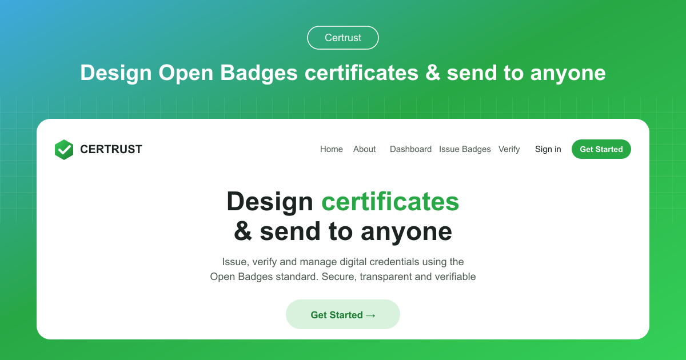

# Certrust

**Skip the paper. Issue certificates people can verify in seconds.**

Certrust is a digital credentials platform for organizations that certify people. Design a certificate or badge, issue it to one person or a thousand, and give every recipient a credential they can share and prove anywhere, instantly. Recipients never pay.

## Why Certrust

Printed certificates cost money to produce and ship, and most end up lost in a drawer. They are also easy to fake and hard to check. Certrust replaces them with digital credentials that are:

- **Verifiable in seconds.** Every credential has a public page and a QR code that anyone can check, with no account needed.
- **Tamper-evident.** Each credential is cryptographically signed, so any change to it is detected.
- **Built on open standards.** Credentials follow Open Badges 3.0 and the W3C Verifiable Credentials data model, so they work beyond Certrust.
- **Free for recipients.** People who receive a credential never need to pay or sign up.

## How it works

### 1. Design and create

- Start from a professional template or design one from scratch
- Add your organization's branding, text, logos, and layout
- Choose from six template types: certificates, badges, transcripts, training records, assessments, and letters
- Duplicate an official template from the curated template library and make it your own

### 2. Issue and deliver

- Issue one credential by hand, or upload a CSV to issue hundreds at once
- CSV imports are validated before anything is sent
- Issue immediately or schedule issuance for a later date
- Recipients get an automatic email with a private link to their credential
- Plan events and link each one to the badge you'll award

### 3. Share and verify

- One-click **Add to LinkedIn** so recipients can show the credential on their profile
- A shareable link for WhatsApp, Slack, email, or social media
- A public verification page with a QR code for in-person checks
- A REST API for programmatic verification

## Features

### Credentials

- Open Badges 3.0 and W3C Verifiable Credentials v2 compliant
- Ed25519 cryptographic signatures
- Revocation, so credentials can be withdrawn and verification shows it
- Supporting evidence shown right on the credential

### For your organization

- A dedicated organization account with its own templates, achievements, and credentials, kept separate from every other organization
- A dashboard with issued, scheduled, and draft counts and a 12-month issuance chart
- Live usage tracking against your plan's limits

### For recipients

- No account needed to receive or share a credential
- Recipients can set a password and see everything they've earned in one dashboard
- Always free

### Languages

The app is available in English, French, German, Spanish, Italian, and Portuguese.

## Who it's for

| Sector | Typical use |
| --- | --- |
| **Government** | Civic training, licensing programs, and public-sector workshops that citizens can check |
| **Education** | Diplomas, course completions, and micro-credentials from universities, schools, and training providers |
| **Private and corporate** | Employee and partner certification after internal training, compliance courses, or professional development |
| **NGOs and nonprofits** | Certificates for workshops, seminars, and community programs, without paying for recipient accounts |

## Plans

Every plan includes full Open Badges 3.0 issuance, public verification, and CSV batch issuance. Plans differ mainly in how much you can issue.

| | Free | Pro | Enterprise |
| --- | --- | --- | --- |
| **Best for** | Pilots, single events, and small programs | Growing programs across several courses or departments | Large-scale, multi-department, or government-wide deployments |
| **Credentials issued** | 50 | 1,000 | Unlimited |
| **Design templates** | 50 | 1,000 | Unlimited |
| **Achievement types** | 50 | 1,000 | Unlimited |
| **Extras** | | Priority email support | Self-hosting available for full data control |

New organizations start with a **14-day Pro trial**, and no credit card is required. Pro and Enterprise are billed monthly or yearly.

## Contact

Questions, support, or Enterprise enquiries: **support@certrust.app**

## License

Certrust is licensed under the GNU Affero General Public License v3.0. See [LICENSE](./LICENSE).
