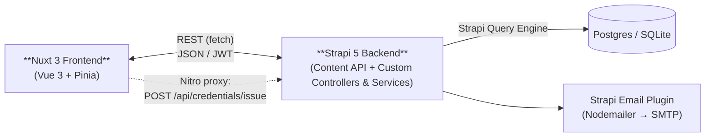

# Architecture

## Repo layout

Certrust is **not** a package-manager monorepo — there's no root `package.json` and no
npm/pnpm/yarn workspaces. It's two independently-managed Node apps living side by
side under `src/`, tied together only by `docker-compose.yml`:

```
certrust/
├── README.md, CONTRIBUTING.md, CODE_OF_CONDUCT.md
├── docker-compose.yml            # postgres + mailhog + backend + frontend
├── ed25519-private.pem / ed25519-public.pem   # dev signing key (see known-issues)
├── docs/                         # this folder
├── scripts/                      # fresh-install.sh, test-fresh-install.js
├── netlify/functions/og-credential/   # standalone Netlify Function, own package.json
└── src/
    ├── backend/     # Strapi 5 (TypeScript) — own package.json + lockfile
    └── frontend/    # Nuxt 3 / Vue 3 — own package.json + lockfile
```

Each app is installed and run independently:

```bash
cd src/backend  && npm install && npm run develop
cd src/frontend && npm install && npm run dev
```

There are also two empty, unused scaffold directories nested at
`src/frontend/src/frontend/` and `src/frontend/src/frontend-una/` — leftovers from
project setup, not referenced by `nuxt.config.ts`. Safe to ignore (or clean up).

## High-level component diagram



Most frontend → backend calls go **directly from the browser** to Strapi
(`NUXT_PUBLIC_API_URL`), not through a Nuxt server API. The one exception is
`server/api/credentials/issue.ts`, a Nitro/h3 route that proxies
`POST /api/credentials/issue` to Strapi while attaching the bearer token
server-side. There is no broader backend-for-frontend layer — this proxy route is
the only one.

## Data flow: issuing a credential

1. Frontend calls `ApiClient.issueBadge(...)` → `POST /api/credentials/issue` (proxied through the Nitro route above).
2. Strapi's `credential` controller/service (`src/backend/src/api/credential/services/credential.ts`):
   - finds-or-creates a `profile` for the recipient by email,
   - finds-or-creates a `users-permissions` **user** account for that profile (random password) so the recipient can log into the frontend later,
   - generates a `credentialId` (`urn:uuid:...`),
   - signs the payload with Ed25519/JWS (`generateProof`),
   - persists the `credential` row with the `proof` component attached,
   - serializes it to an OBv3 JSON object (`open-badge.ts`'s `serializeCredential`),
   - sends an email to the recipient via Strapi's `email` plugin.
3. Response includes the Strapi `credential` record **and** the serialized OBv3 JSON.

See [strapi-and-credentials.md](./strapi-and-credentials.md) for the full breakdown
of this flow, including the email/notification path and its current bugs.

## Deployment topology

The repo ships a **Docker Compose** setup (Postgres 16 + Mailhog + backend +
frontend) intended for local dev / self-hosting. But the actual **production**
deployment is inferred from the CORS allow-list in
`src/backend/config/middlewares.ts` and the Netlify function's default API URL —
it's PaaS-hosted, not the Docker Compose stack:

- **Frontend**: Netlify (`certrust.netlify.app`, custom domain e.g. `certrust.example.org` — set your own), including Netlify deploy-preview URLs.
- **Backend**: Strapi Cloud (`bold-approval-5bde4fbd5d.strapiapp.com`) and/or a custom-domain backend (`certrust-strapi.schroedinger-hat.org`).
- **OG image generation**: a standalone Netlify Function (`netlify/functions/og-credential/`) using `satori`, called for social-share previews (e.g. LinkedIn), fetching credential data from `CERTRUST_API_URL`.

A Helm chart now exists ([`helm/certrust/`](../helm/certrust/), see
[kubernetes.md](./kubernetes.md)) with images published to GHCR via
`.github/workflows/docker-publish.yml` — this is a self-hosting option, not
a change to the actual current production deployment above (still
Netlify/Strapi Cloud). Terraform modules remain future work.

## CI/CD

Two GitHub Actions workflows: `.github/workflows/frontend/autofix.yml` (runs
`eslint --fix` on the frontend and auto-commits the result), and
`.github/workflows/ci.yml` (two jobs on push/PR to `main` — `backend`:
type-check, `npm test`, `npm run build`; `frontend`: `npm run test:unit`,
`npm run build`). Playwright E2E isn't run in CI (needs a browser install,
heavier — not yet added). No workflow produces a Docker image.

## Testing

- **Frontend**: Vitest + `@vue/test-utils` + `@nuxt/test-utils` for component/unit specs (`src/frontend/components/__tests__/`, plus specs for the API clients and middleware), and Playwright E2E specs (`src/frontend/e2e/`).
- **Backend**: Jest (`npm test`, `jest.config.js`), unit-level only — no full Strapi bootstrap/DB, just the highest-risk crypto logic tested directly: `utils/key-encryption.ts`, `api/profile/services/issuer-keys.ts`, and `api/credential/services/verification.ts`'s `verifyProof()`. `jose` ships ESM-only, so Jest needs a babel transform (`babel.config.js`, Jest-only — the app itself is built by Strapi, not Babel) to load it. `scripts/test-fresh-install.js` remains a separate manual script that checks seed data was created correctly.
